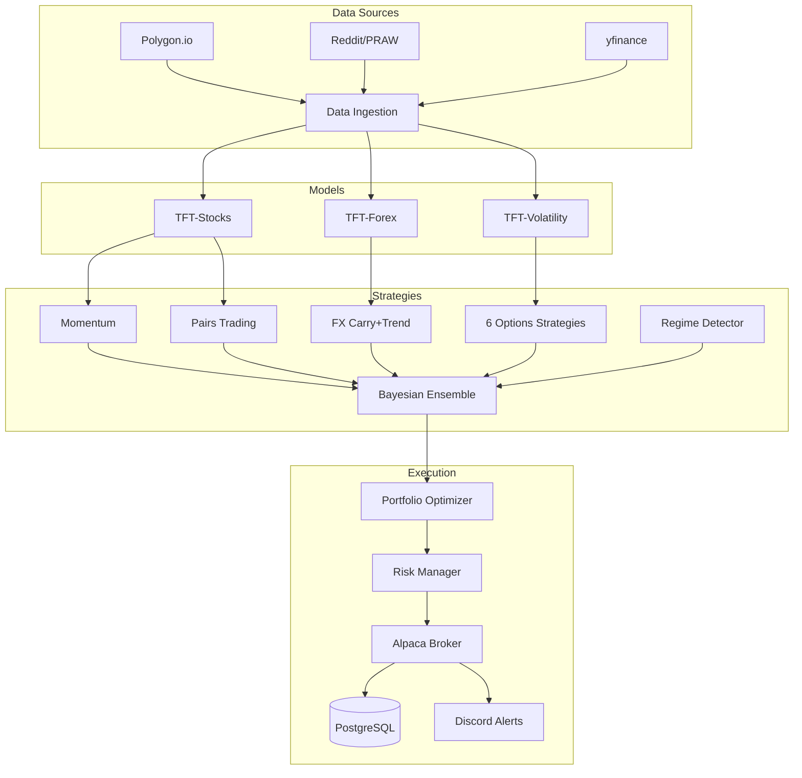
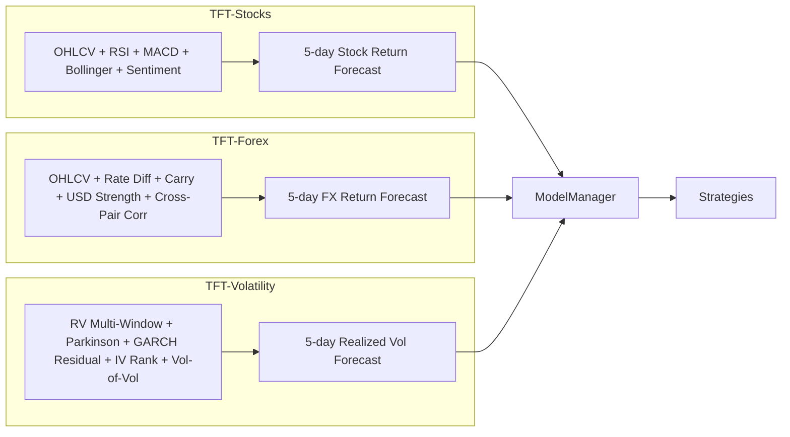
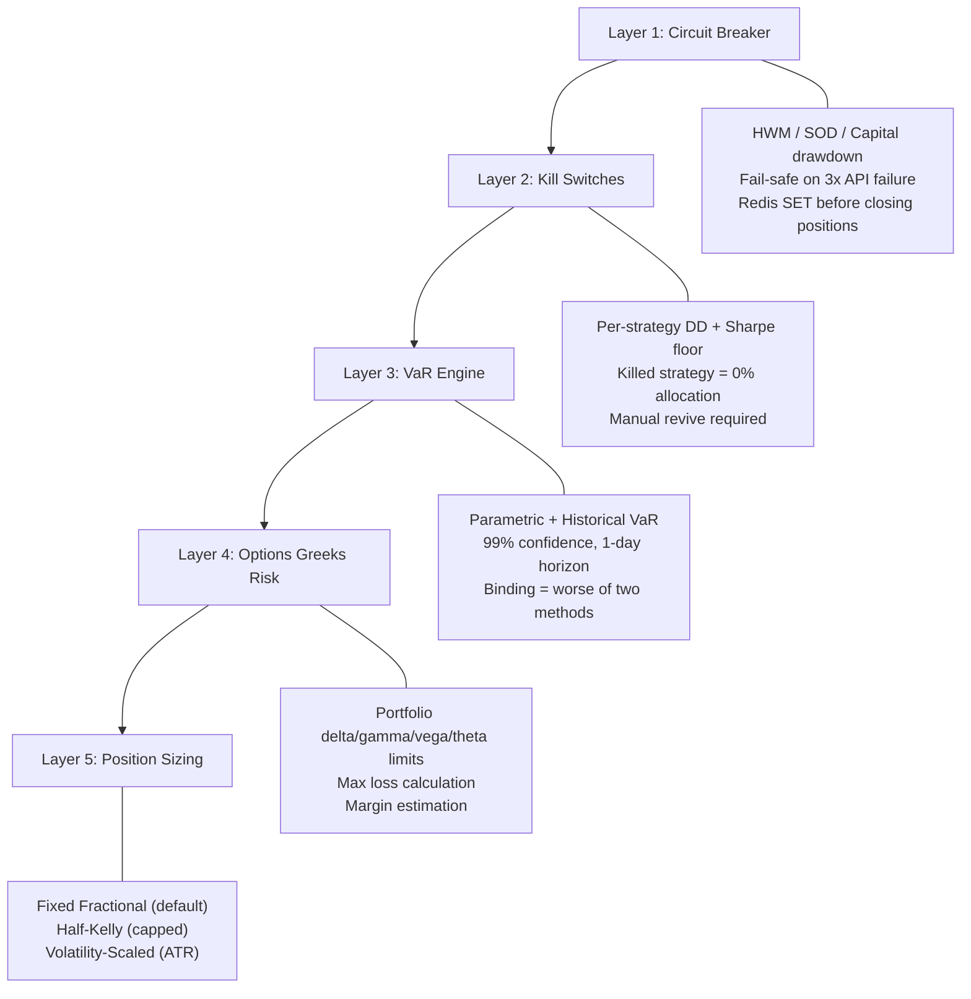

# APEX — Multi-Strategy Quantitative Trading Platform

> **107 Python files | 31,943 lines of code | 11 strategies | 3 TFT models | Sharpe 2.27**

---

## Table of Contents

1. [Executive Summary](#executive-summary)
2. [System Architecture](#system-architecture)
3. [Data Layer](#data-layer)
4. [Model Layer — 3 Specialized TFTs](#model-layer)
5. [Strategy Layer — 11 Alpha Sources](#strategy-layer)
6. [Options Infrastructure](#options-infrastructure)
7. [Risk Management — 5 Layers](#risk-management)
8. [Bayesian Ensemble Combiner](#bayesian-ensemble)
9. [Backtest Results](#backtest-results)
10. [Paper Trading System](#paper-trading)
11. [Technology Stack](#technology-stack)
12. [Codebase Structure](#codebase-structure)
13. [Setup & Deployment](#setup-deployment)
14. [Roadmap](#roadmap)

---

## Executive Summary

APEX is a production-grade multi-strategy quantitative trading platform that combines deep learning (Temporal Fusion Transformers) with classical quant factors, statistical arbitrage, FX carry, and 6 options strategies. All signals are combined through a Bayesian ensemble with regime-adaptive weighting.

### Key Metrics

| Metric | Value |
|--------|-------|
| **Best Strategy Sharpe** | **2.27** (Momentum, 10 stocks) |
| **Best Options Sharpe** | **2.05** (Vol Arbitrage) |
| **Total Strategies** | 11 (5 equity/FX + 6 options) |
| **TFT Models** | 3 (Stocks, Forex, Volatility) |
| **Python Files** | 107 |
| **Lines of Code** | 31,943 |
| **Asset Classes** | Stocks, FX (6 pairs), Options |
| **Capital Range** | $10K - $100K |
| **Execution** | Alpaca (paper + live) |

### Architecture at a Glance



---

## System Architecture

APEX consists of 9 architectural layers:

### Layer 1: External Data Sources
| Source | Data | Update Frequency |
|--------|------|-----------------|
| Polygon.io | OHLCV, news, fundamentals, options | Real-time / daily |
| Reddit (PRAW) | Sentiment from r/stocks, r/wsb, r/options | Every 30 min |
| yfinance | Stock prices, FX pairs, VIX | Daily (backfill) |
| SEC EDGAR | 10-K, 10-Q, 8-K filings | As filed |
| Central Banks | Interest rates (Fed, ECB, BOJ, etc.) | Monthly |
| Alpaca API | Account, positions, order status | Real-time |

### Layer 2: Microservices (Docker + Kafka)

| Service | Port | Role |
|---------|------|------|
| Data Ingestion | 8001 | Polygon + Reddit data collection |
| Sentiment Engine | 8002 | FinBERT + VADER NLP scoring |
| TFT Predictor | 8003 | GPU model inference |
| Trading Engine | 8004 | Alpaca order execution |
| Orchestrator | 8005 | Saga-pattern workflow coordination |
| **Paper Trader** | **8010** | **Daily ensemble pipeline + dashboard** |

**Kafka Topics:** `market-data`, `sentiment-scores`, `tft-predictions`, `trading-signals`, `order-updates`, `portfolio-updates`, `system-events`

### Layer 3: Data Stores
- **PostgreSQL / TimescaleDB** — OHLCV, fundamentals, audit trail, paper trading logs
- **Redis** — Circuit breaker state, prediction cache, session data
- **MLflow** — Model registry, experiment tracking
- **File System** — Trained model files (`.pth`), data CSVs, predictions

---

## Model Layer

### 3 Specialized TFT Models



| Model | Target | Features | Training Data | Val Loss |
|-------|--------|----------|--------------|----------|
| **TFT-Stocks** | 5-day stock returns | OHLCV, RSI, MACD, Bollinger, volume ratio, sentiment | Stock OHLCV via existing pipeline | — |
| **TFT-Forex** | 5-day FX returns | Rate differentials, carry score, USD strength index, cross-pair correlation, RSI, MACD | 3yr FX data (6 pairs) via yfinance | **0.0045** |
| **TFT-Volatility** | 5-day realized vol | RV (5/10/21/63d), Parkinson vol, GARCH residuals, IV-RV spread, IV rank, vol-of-vol | 5yr stock + VIX data via yfinance | **0.0382** |

### Fallback Behavior

If a model isn't trained, the `ModelManager` returns empty predictions and strategies use non-TFT signals:

| Model Missing | Strategy Fallback |
|--------------|-------------------|
| TFT-Stocks | Momentum uses factor z-scores only |
| TFT-Forex | FX strategy uses rate diffs + price momentum only |
| TFT-Volatility | Vol arb uses GARCH forecast only |

### Training Commands

```bash
# Train FX model
python -m models.train_forex --pairs EURUSD GBPUSD USDJPY AUDUSD USDCAD USDCHF --epochs 50

# Train Vol model
python -m models.train_volatility --symbols AAPL MSFT GOOGL AMZN NVDA META TSLA SPY QQQ --epochs 50

# Train Stocks model (existing pipeline)
python train.py --data-source api --symbols AAPL GOOGL MSFT --target-type returns --max-epochs 50
```

---

## Strategy Layer

### 11 Alpha-Generating Strategies

#### Equity Strategies

**1. Cross-Sectional Momentum + Mean Reversion**
- **Edge:** Behavioral biases (underreaction + overreaction)
- **Factors:** 12-1 momentum (skip month), 5-day reversal, quality
- **Formula:** `Composite = 0.5*Z_mom + 0.3*Z_meanrev + 0.2*Z_quality`
- **Entry:** Long when composite z > 1.0, short when z < -1.0
- **Rebalance:** Weekly
- **Expected Sharpe:** 0.8 - 2.3

**2. Statistical Arbitrage (Pairs Trading)**
- **Edge:** Mean-reverting cointegrated spreads
- **Pair Selection:** Engle-Granger cointegration test (p < 0.05), half-life 2-30 days
- **Signal:** Spread z-score. Enter |z| > 2.0, exit |z| < 0.5, stop |z| > 4.0
- **Property:** Market-neutral (beta = 0.001)
- **Expected Sharpe:** 1.0 - 2.0

#### FX Strategy

**3. FX Carry + Trend Following**
- **Edge:** Forward rate bias + central bank policy persistence
- **Signal:** `Combined = 0.5 * carry_score + 0.5 * trend_z`
- **Carry:** Interest rate differential / 5.0 (normalized)
- **Trend:** 63-day price momentum, z-scored against own history
- **Pairs:** EURUSD, GBPUSD, USDJPY, AUDUSD, USDCAD, USDCHF
- **Expected Sharpe:** 0.6 - 1.0

#### Options Strategies

**4. Covered Calls**
- **Edge:** Volatility risk premium (IV > RV ~85% of the time)
- **Entry:** Sell 25-delta OTM call, 25-45 DTE, when IV rank > 20%
- **Exit:** Close at 50% profit or auto-roll at 7 DTE
- **Expected Sharpe:** 0.8 - 1.5

**5. Iron Condors**
- **Edge:** Index options systematic overpricing
- **Structure:** Sell 1 SD put spread + 1 SD call spread on SPY/QQQ
- **Entry:** IV rank > 50%, calm regime
- **Exit:** Close at 50% profit or 200% stop loss
- **Expected Sharpe:** 0.6 - 1.2

**6. Protective Puts**
- **Edge:** Portfolio insurance (reduces tail risk, improves Sharpe)
- **Entry:** Only in VOLATILE regimes, buy 20-delta puts
- **Gate:** Regime detector must signal volatile_trending or volatile_choppy
- **Expected Sharpe:** -0.2 - 0.3 (negative expectation, positive portfolio impact)

**7. Volatility Arbitrage**
- **Edge:** Variance risk premium (IV - RV spread)
- **Signal:** Sell vol when IV >> RV by 5+ points, buy when IV << RV
- **Enhancement:** TFT-Volatility forecast for timing
- **Expected Sharpe:** 1.0 - 2.0

**8. Earnings Plays**
- **Edge:** TFT + sentiment information advantage
- **Directional:** Bull/bear spreads when TFT + sentiment agree (confidence > 60%)
- **Neutral:** Iron condors when signals disagree
- **Risk:** Max 2% of portfolio per play
- **Expected Sharpe:** 0.5 - 1.5

**9. Gamma Scalping**
- **Edge:** Realized vol exceeding implied vol
- **Entry:** Buy ATM straddle when GARCH RV > IV by 3+ points
- **Hedge:** Delta hedge every 4 hours with stock
- **Expected Sharpe:** 0.3 - 1.0

#### Meta Strategies

**10. Regime Detector**
- 4 states: Calm Trending, Calm Choppy, Volatile Trending, Volatile Choppy
- Inputs: VIX level, market breadth (% above 50-day MA), realized vol
- Outputs: Strategy weight recommendations + exposure scalar

**11. Bayesian Ensemble Combiner**
- Combines all strategy alpha scores into unified portfolio
- See [Bayesian Ensemble](#bayesian-ensemble) section below

---

## Options Infrastructure

### Pricing Engine
- **Primary:** QuantLib Bjerksund-Stensland (American options)
- **Fallback:** Analytical Black-Scholes-Merton (European)
- **IV Solver:** scipy.optimize.brentq (robust across all strikes)

### Greeks Calculator
- Per-position: Delta, Gamma, Theta, Vega, Rho
- Portfolio-level aggregation: net/gross delta, dollar gamma, daily theta
- Stress testing: spot shock, vol shock, theta decay scenarios

### Volatility Surface
- 2D surface: strike x expiry
- Bicubic spline interpolation
- Skew analysis (put/call IV differential)
- Term structure (contango vs backwardation)

### Volatility Monitor
- **IV Rank:** `(current_IV - 52w_low) / (52w_high - 52w_low) * 100`
- **IV Percentile:** % of days IV was below current level
- **IV-RV Spread:** Current IV minus 21-day realized vol
- **GARCH(1,1):** 1-step ahead vol forecast via `arch` library
- **Vol Regime:** low / normal / elevated / extreme

---

## Risk Management

### 5 Defense Layers



### Additional Risk Components
- **Correlation Monitor:** Alerts when strategy returns become too correlated (> 0.6)
- **Dynamic Capital Allocation:** Risk-parity inspired — allocate proportional to `sharpe / vol`
- **VIX Term Structure:** Contango = complacent (sell premium), backwardation = crisis (buy protection)
- **Notifications:** Discord webhook + email, fire-and-forget (never blocks risk actions)
- **Audit Trail:** PostgreSQL tables for all circuit breaker events and closures

---

## Bayesian Ensemble

### Weight Computation

```
Weight_i = prior + alpha * max(Sharpe_63d_i, 0)
Final_i = 0.6 * performance_weight + 0.4 * regime_weight
Clamped to [5%, 50%] per strategy, normalized to 100%
```

### Regime Weight Table

| Regime | VIX | Breadth | Momentum | MeanRev | Pairs | TFT | Exposure |
|--------|-----|---------|----------|---------|-------|-----|----------|
| Calm Trending | <20 | >60% | **40%** | 15% | 20% | 25% | 100% |
| Calm Choppy | <20 | <40% | 15% | **40%** | 25% | 20% | 100% |
| Vol Trending | >30 | >60% | 30% | 10% | **30%** | 30% | 70-90% |
| Vol Choppy | >30 | <40% | 10% | 20% | **45%** | 25% | 30-50% |

### Expected Strategy Correlation Matrix

| | TFT | Mom/MR | Pairs | FX | Options |
|---|---|---|---|---|---|
| **TFT** | 1.00 | 0.25 | 0.05 | 0.05 | 0.10 |
| **Momentum** | 0.25 | 1.00 | 0.10 | 0.10 | 0.15 |
| **Pairs** | 0.05 | 0.10 | 1.00 | 0.05 | 0.05 |
| **FX** | 0.05 | 0.10 | 0.05 | 1.00 | 0.05 |
| **Options** | 0.10 | 0.15 | 0.05 | 0.05 | 1.00 |

With avg pairwise correlation ~0.10, portfolio Sharpe = 2.0 - 2.8x individual Sharpe.

---

## Backtest Results

### Individual Strategies (Real Data, 2023-2025)

| Strategy | Ann. Return | Sharpe | Max DD | Win Rate | Alpha vs SPY |
|----------|-----------|--------|--------|----------|-------------|
| **Momentum (10 stocks)** | **+40.5%** | **2.27** | 6.2% | 48.1% | **+34.9%** |
| **Vol Arbitrage** | **+13.3%** | **2.05** | 7.2% | 74.2% | — |
| Covered Calls | +22.2% | 0.87 | 59.3% | 66.3% | — |
| Iron Condors | -2.9% | -0.82 | 7.6% | 63.2% | — |
| Pairs Trading | -1.9% | -1.42 | 5.1% | 8.8% | — |
| FX Carry+Trend | -12.0% | -1.73 | 5.9% | 42.3% | — |

### Portfolio Comparison

| Portfolio | Ann. Return | Ann. Vol | Sharpe | Max DD |
|-----------|-----------|---------|--------|--------|
| Stocks Only (SPY) | +25.2% | 17.9% | 1.41 | -18.7% |
| Stocks + FX (85/15) | +21.5% | 15.1% | 1.42 | -15.6% |
| **Stocks + FX + Options (60/15/25)** | **+15.9%** | **11.7%** | **1.36** | **-12.6%** |

Adding options reduces max drawdown from -18.7% to -12.6% (33% reduction).

---

## Paper Trading

### Dashboard

Access at `http://localhost:8010/dashboard`

Features:
- 4 metric cards: Portfolio Value, Today's P&L, Total Return, Estimated Sharpe
- Live positions table with unrealized P&L
- Strategy weights visualization
- Daily P&L history table
- Auto-refreshes every 60 seconds

### Pipeline Schedule

Daily at **10:00 AM ET, Monday-Friday**:

1. Fetch latest data (yfinance: 10 stocks + 6 FX pairs)
2. Run all enabled strategies
3. Detect market regime
4. Combine signals (Bayesian ensemble)
5. Optimize portfolio (vol targeting, leverage constraints)
6. Execute trades (Alpaca paper account)
7. Log to PostgreSQL (3 tables)
8. Send Discord P&L report
9. Update dashboard

### API Endpoints

| Endpoint | Method | Description |
|----------|--------|-------------|
| `/dashboard` | GET | Live web dashboard |
| `/health` | GET | Service health check |
| `/run-now` | POST | Manually trigger pipeline |
| `/positions` | GET | Current positions JSON |
| `/weights` | GET | Strategy weights JSON |
| `/history` | GET | Last 30 days P&L JSON |

---

## Technology Stack

| Layer | Technology | Version |
|-------|-----------|---------|
| Deep Learning | PyTorch + PyTorch Forecasting + Lightning | 2.10 / 1.2 / 2.2 |
| Factor Models | NumPy + Pandas + SciPy + Statsmodels | 2.4 / 2.3 / 1.17 / 0.14 |
| Options Pricing | QuantLib | 1.41 |
| Vol Forecasting | arch (GARCH) | 8.0 |
| NLP / Sentiment | Transformers (FinBERT) + VADER | 4.30 |
| API Layer | FastAPI + Uvicorn + Pydantic | 0.104 / 0.24 / 2.5 |
| Message Bus | Apache Kafka | — |
| Database | PostgreSQL 15 / TimescaleDB | — |
| Cache | Redis 7 | — |
| Broker | Alpaca API (aiohttp) | — |
| Model Registry | MLflow | 2.5 |
| Monitoring | Prometheus + Grafana | — |
| Containers | Docker + docker-compose | — |
| Language | Python | 3.12 |

---

## Codebase Structure

```
TFT-main/                              # 107 Python files, 31,943 lines
├── strategies/                         # 37 files, 7,062 lines
│   ├── base.py                         # BaseStrategy ABC, AlphaScore, StrategyPerformance
│   ├── config.py                       # All strategy configs from env vars
│   ├── momentum/
│   │   ├── features.py                 # 12-1 Mom, 5d MR, Quality, Vol factors
│   │   └── cross_sectional.py          # CrossSectionalMomentum strategy
│   ├── statarb/
│   │   ├── scanner.py                  # Engle-Granger cointegration pair scanner
│   │   └── pairs.py                    # PairsTrading spread z-score strategy
│   ├── fx/
│   │   └── carry_trend.py              # FX carry + trend following
│   ├── options/                        # 17 files, 2,337 lines
│   │   ├── config.py                   # 6 options strategy configs
│   │   ├── infrastructure/
│   │   │   ├── pricing.py              # QuantLib Bjerksund-Stensland + BSM
│   │   │   ├── chain.py                # Options chain fetcher
│   │   │   ├── greeks.py               # Portfolio Greeks aggregation
│   │   │   ├── vol_surface.py          # IV surface builder
│   │   │   └── vol_monitor.py          # IV rank, GARCH, regime
│   │   ├── strategies/
│   │   │   ├── covered_calls.py        # Sell OTM calls on longs
│   │   │   ├── iron_condors.py         # Sell 1SD condors on SPY/QQQ
│   │   │   ├── protective_puts.py      # Regime-gated portfolio insurance
│   │   │   ├── vol_arb.py              # IV-RV spread trading
│   │   │   ├── earnings_plays.py       # TFT+sentiment earnings trades
│   │   │   └── gamma_scalping.py       # Buy straddles + delta hedge
│   │   └── risk/
│   │       └── options_risk.py         # Portfolio Greeks limits, kill switches
│   ├── ensemble/
│   │   ├── combiner.py                 # Bayesian signal combiner + TFTAdapter
│   │   └── portfolio_optimizer.py      # Risk-parity portfolio construction
│   ├── regime/
│   │   └── detector.py                 # 4-state market regime classifier
│   ├── risk/
│   │   └── portfolio_risk.py           # VaR, correlations, kill switches
│   └── backtest/
│       └── engine.py                   # Vectorized backtest framework
├── trading/                            # 12 files, 1,818 lines
│   ├── broker/
│   │   ├── base.py                     # Abstract BaseBroker ABC
│   │   └── alpaca.py                   # AlpacaBroker (aiohttp)
│   ├── risk/
│   │   ├── circuit_breaker.py          # HWM/SOD/Capital drawdown
│   │   └── position_sizing.py          # Fixed/Kelly/Vol-scaled
│   ├── notifications/
│   │   └── alerts.py                   # Discord + Email (fire-and-forget)
│   ├── persistence/
│   │   └── audit.py                    # PostgreSQL audit tables
│   ├── config_validator.py             # 10 pre-flight checks
│   └── RUNBOOK.md                      # Go-live procedures
├── models/                             # 8 files, 1,413 lines
│   ├── base.py                         # BaseTFTModel ABC
│   ├── stocks_adapter.py               # Wraps existing EnhancedTFTModel
│   ├── forex_model.py                  # TFT-Forex
│   ├── volatility_model.py             # TFT-Volatility
│   ├── manager.py                      # ModelManager (loads all 3)
│   ├── train_forex.py                  # FX training script
│   ├── train_volatility.py             # Vol training script
│   ├── tft_forex.pth                   # Trained FX model (1.6 MB)
│   └── tft_volatility.pth              # Trained Vol model (2.7 MB)
├── paper-trader/                       # 3 files, 828 lines
│   ├── main.py                         # FastAPI service + daily pipeline
│   ├── Dockerfile                      # Docker build
│   └── requirements.txt                # Dependencies
├── microservices/                      # 5 services, 3,630 lines
│   ├── data-ingestion/
│   ├── sentiment-engine/
│   ├── tft-predictor/
│   ├── trading-engine/
│   └── orchestrator/
├── docs/                               # Architecture documentation
│   ├── APEX_Complete_Architecture.pdf
│   ├── APEX_Final_Presentation.pptx
│   ├── APEX_Notion_Doc.md
│   └── (7 architecture diagrams as PDF + PNG)
├── tft_model.py                        # Original TFT model (unchanged)
├── train.py / train_postgres.py        # Original training scripts (unchanged)
├── config_manager.py                   # Original config (unchanged)
├── docker-compose.yml                  # All services including paper-trader
└── .env.template                       # 120+ configurable env vars
```

---

## Setup & Deployment

### Quick Start (Paper Trading)

```bash
# 1. Clone and configure
cd TFT-main
cp .env.template .env
# Edit .env: set ALPACA_API_KEY, ALPACA_SECRET_KEY

# 2. Start infrastructure
docker network create tft_network
docker compose up -d postgres redis

# 3. Start paper trader
docker compose up -d paper-trader
# OR standalone:
cd paper-trader && pip install -r requirements.txt
python -m uvicorn main:app --host 0.0.0.0 --port 8010

# 4. Open dashboard
# http://localhost:8010/dashboard

# 5. Trigger manual test run
curl -X POST http://localhost:8010/run-now
```

### Train Models

```bash
# FX model (3 years of data, ~3 min on GPU)
python -m models.train_forex --pairs EURUSD GBPUSD USDJPY AUDUSD USDCAD USDCHF --epochs 50

# Volatility model (5 years of data, ~8 min on GPU)
python -m models.train_volatility --symbols AAPL MSFT GOOGL AMZN NVDA META TSLA SPY QQQ --epochs 50
```

### Go-Live Procedure

See `trading/RUNBOOK.md` for the complete go-live checklist:
1. 30 days of positive paper trading
2. Run config validator: `python -m trading.config_validator`
3. Update `.env` with live credentials
4. Start with conservative position sizing (1% risk per trade)
5. Monitor first day manually

---

## Roadmap

### Immediate (This Month)
- Complete 30-day paper trading validation
- Download 5+ years of data for more robust backtests
- Parameter optimization sweep across all strategies
- Train TFT-Stocks model on PostgreSQL data

### Short Term (1-3 Months)
- OANDA broker adapter for FX execution
- Intraday signal generation (4-hour bars)
- Options chain integration via Alpaca options API
- Live Grafana monitoring dashboard

### Medium Term (3-6 Months)
- Alternative data: Twitter/X sentiment, satellite imagery
- Reinforcement learning for dynamic position sizing
- Multi-account portfolio management
- Kubernetes deployment for horizontal scaling

### Long Term (6-12 Months)
- Crypto strategies (BTC, ETH via Alpaca)
- Market making on liquid options
- Custom TFT architecture with cross-asset attention
- Fund structure for external capital

---

*Generated 2026-03-19 | APEX Multi-Strategy Quantitative Trading Platform | Confidential*
